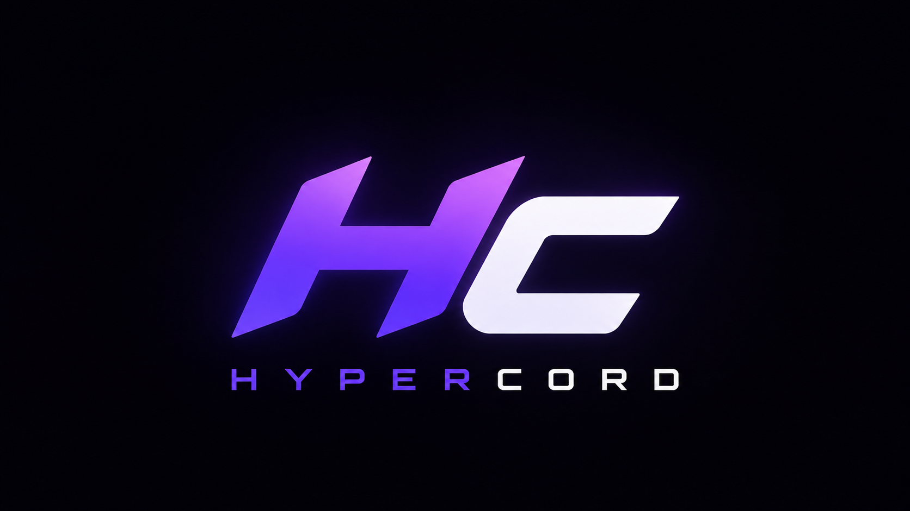

<div align="center">


# HyperCord

</div>


<!-- TODO(discord): Discord sunucun hazır olduğunda invite linkini ekleyip bu satırı aç -->
<!-- [](https://discord.gg/YOUR_INVITE) -->

Vencord tabanlı, **Equicord'dan daha fazla plugin** içermeyi ve piyasada adını duyurmayı hedefleyen bir Discord client mod'u.



## Features

-   Easy to install
-   Vencord'un tüm built-in plugin'leri + HyperCord'a özel onlarca ek plugin (Fun, Utility, Chat, Voice Chat, Themes, Experimental)
-   Fairly lightweight despite the many inbuilt plugins
-   Excellent Browser Support: Run HyperCord in your Browser via extension or UserScript
-   Works on any Discord branch: Stable, Canary or PTB all work
-   Custom CSS and Themes: Inbuilt css editor with support to import any css files (including BetterDiscord themes)
-   Privacy friendly: blocks Discord analytics & crash reporting out of the box and has no telemetry
-   **Yol haritasında:** kendi plugin marketi, otomatik güncelleme sistemi, bulut ayar senkronizasyonu (bkz. [proje.md](./proje.md))

## Installing / Uninstalling

<!-- TODO(domain): Resmi bir installer/indirme sayfan olduğunda linkini buraya ekle -->

Şu an için resmi bir installer/website yok, kaynak koddan derleyip kurabilirsin:

```sh
git clone https://github.com/Henox77/hypercord
cd hypercord
pnpm install
pnpm build
pnpm inject
```

Kaldırmak için:

```sh
pnpm uninject
```

## Join our Support/Community Server

<!-- TODO(discord): Discord sunucun hazır olduğunda invite linkini buraya ekle -->

_yakında_

## Contributing

Katkı sağlamak istersen [CONTRIBUTING.md](./CONTRIBUTING.md) dosyasına göz at.

## Star History

<a href="https://star-history.com/#Henox77/hypercord&Timeline">
  <picture>
    <source media="(prefers-color-scheme: dark)" srcset="https://api.star-history.com/svg?repos=Henox77/hypercord&type=Timeline&theme=dark" />
    <source media="(prefers-color-scheme: light)" srcset="https://api.star-history.com/svg?repos=Henox77/hypercord&type=Timeline" />
    
  </picture>
</a>

## Credits & License

GNU General Public License v3.0 — bkz. [LICENSE](./LICENSE).

Bu proje [Vencord](https://github.com/Vendicated/Vencord)'un bir forku olarak başlamıştır. Orijinal Vencord ekibine ve tüm katkıda bulunanlara teşekkürler.

## Disclaimer

Discord is trademark of Discord Inc. and solely mentioned for the sake of descriptivity.
Mention of it does not imply any affiliation with or endorsement by Discord Inc.

<details>
<summary>Using HyperCord violates Discord's terms of service</summary>

Client modifications are against Discord's Terms of Service.

However, Discord is pretty indifferent about them and there are no known cases of users getting banned for using client mods! So you should generally be fine as long as you don't use any plugins that implement abusive behaviour. But no worries, all inbuilt plugins are safe to use!

Regardless, if your account is very important to you and it getting disabled would be a disaster for you, you should probably not use any client mods (not exclusive to HyperCord), just to be safe.

Additionally, make sure not to post screenshots with HyperCord in a server where you might get banned for it.

</details>
